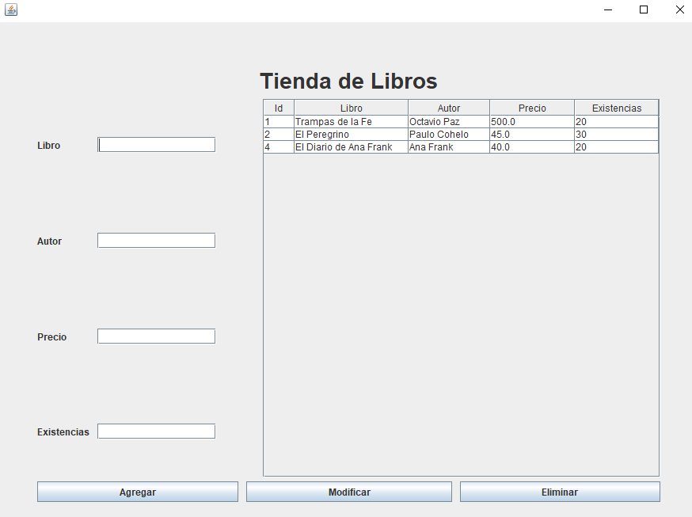

# 📚 Tienda de Libros con Swing y Spring Boot

## 🖍️ Descripción  
Este proyecto consiste en una **aplicación de escritorio para la gestión de una tienda de libros**, desarrollada con **Java Swing y Spring Boot**. La aplicación permite **agregar, eliminar, actualizar y listar libros** dentro de una base de datos MySQL. Se integran las ventajas de **Swing** para la interfaz gráfica y **Spring Boot** para la gestión de la lógica de negocio y la persistencia de datos.  

Este sistema forma parte de un curso práctico de Java, donde se exploran las tecnologías modernas para la creación de aplicaciones robustas y escalables.  

## 🛠️ Tecnologías Usadas  
- **Lenguaje:** Java (versión 17 o superior).  
- **Interfaz gráfica:** Java Swing.  
- **Framework:** Spring Boot.  
- **Persistencia de Datos:** JPA (Java Persistence API) con Hibernate.  
- **Base de Datos:** MySQL.  
- **Herramientas:** IntelliJ IDEA / NetBeans / Eclipse (cualquier IDE compatible con Java).  

## 🔥 Características  
- Aplicación de escritorio con interfaz intuitiva basada en Java Swing.  
- Permite la gestión completa de libros: **agregar, modificar, eliminar y visualizar**.  
- Uso de **Spring Boot y JPA** para el acceso y la gestión de datos.  
- Arquitectura basada en **MVC (Modelo-Vista-Controlador)** para una mejor organización del código.  
- Integración con MySQL para almacenar la información de los libros.  

## 🚀 Instrucciones de Instalación  
1. **Clona el repositorio** en tu máquina local:  
   ```bash
   git clone https://github.com/tu-usuario/tienda-libros-swing.git
   ```
2. **Configura la base de datos MySQL:**  
   - Crea una base de datos llamada `tienda_libros`.  
   - Importa el archivo `schema.sql` incluido en el proyecto.  

3. **Modifica el archivo `application.properties` en `src/main/resources`** con tus credenciales de MySQL:  
   ```properties
   spring.datasource.url=jdbc:mysql://localhost:3306/tienda_libros_db?createDatabaseIfNotExist=true
   spring.datasource.username=tu_usuario
   spring.datasource.password=tu_contraseña
   ```

4. **Compila y ejecuta la aplicación:**  
   ```bash
   mvn clean install
   mvn spring-boot:run
   ```


## 🖼️ Captura de Pantalla  


