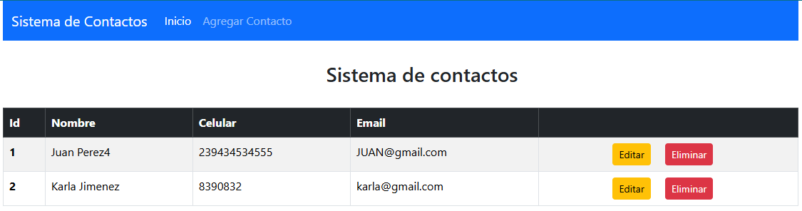
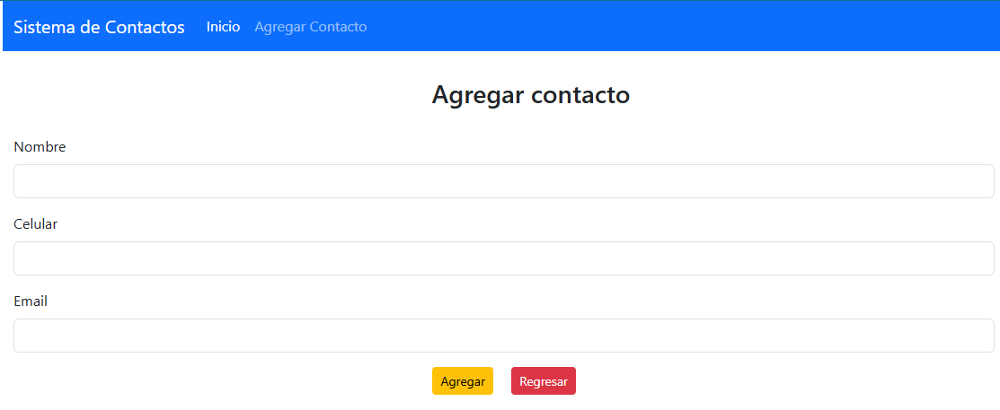
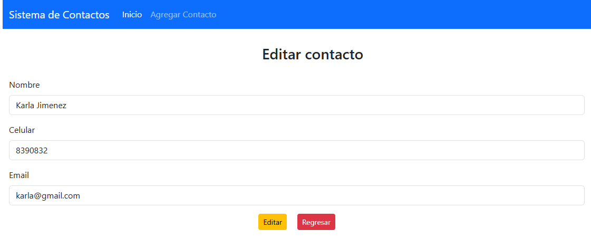

# 📒 Agenda de Contactos con Thymeleaf y Spring Boot  

## 📚 **Descripción**  
Este proyecto es una **aplicación web** que permite gestionar una agenda de contactos. Desarrollado como parte de un curso práctico de Java, utiliza **Thymeleaf** para la capa de presentación y **Spring Boot** para el backend. La aplicación permite agregar, eliminar, actualizar y listar contactos, conectándose a una base de datos para almacenar la información de manera persistente.  

## 🛠️ **Tecnologías Usadas**  
- **Lenguaje:** Java (versión 17 o superior).  
- **Framework:** Spring Boot.  
- **Persistencia de Datos:** JPA (Java Persistence API).  
- **Base de Datos:** MySQL.  
- **Frontend:** Thymeleaf, HTML, CSS, Bootstrap (si aplica).  
- **Herramientas:** IntelliJ IDEA (o cualquier IDE compatible con Java).  

## 🧩 **Características**  
- Permite agregar, eliminar, actualizar y listar contactos.  
- Usa Thymeleaf para generar vistas dinámicas en el frontend.  
- Configuración simplificada gracias a Spring Boot.  
- Interfaz web intuitiva y fácil de usar.  

## 🚀 **Cómo Ejecutar el Proyecto**  

### **Requisitos Previos**  
- Java JDK 17 o superior.  
- MySQL instalado y configurado.  
- Maven instalado (para gestionar dependencias).  

### **Pasos para Configurar y Ejecutar**  

1. **Clona el repositorio:**  
   ```bash
   git clone https://github.com/LucasIsac/java-13-proyectos-udemy.git
   ```

2. **Navega a la carpeta del proyecto:**
   ```bash
   cd java-13-proyectos-udemy/4-Web-Apps/day-10-contact-agenda
   ```

3. **Configura la base de datos:**
   - Asegúrate de que MySQL esté en ejecución.

   - El archivo `application.properties` ya está configurado para usar la base de datos `contactos_db`. Si no existe, se creará automáticamente gracias a la opción `createDatabaseIfNotExist=true`.

   - Verifica que las credenciales de MySQL coincidan con las de tu entorno. El archivo `application.properties` contiene:
     ````properties
     # Conexión MySQL
      spring.datasource.url = jdbc:mysql://localhost:3306/contactos_db?createDatabaseIfNotExist=true
      spring.datasource.username = root
      spring.datasource.password =
      spring.datasource.driver-class-name = com.mysql.cj.jdbc.Driver

      # Configuración de Hibernate
      spring.jpa.hibernate.ddl-auto = update
      spring.jpa.show-sql = true
     ````

   - Si tu usuario de MySQL no es `root` o si tienes una contraseña, actualiza las propiedades `spring.datasource.username` y `spring.datasource.password`.
     
4. **Compila y ejecuta el proyecto:**
   - Usa Maven para compilar y ejecutar la aplicación:
   ```bash
   mvn spring-boot:run
   ```

6. **Accede a la aplicación:**
   - Abre tu navegador y visita:
   ```arduino
   http://localhost:8080
   ```

## 📸 **Agenda de Contactos**  



