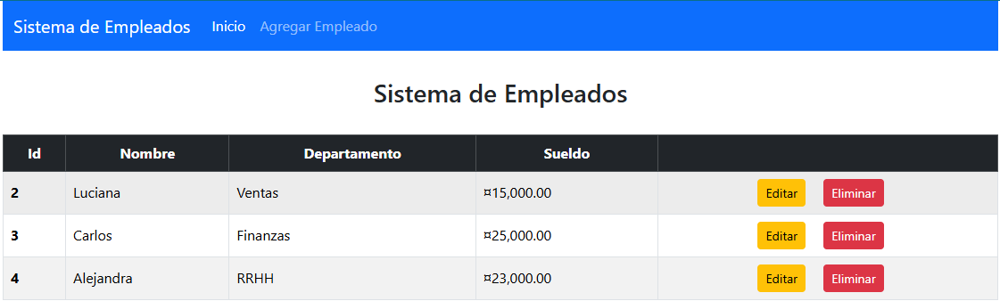
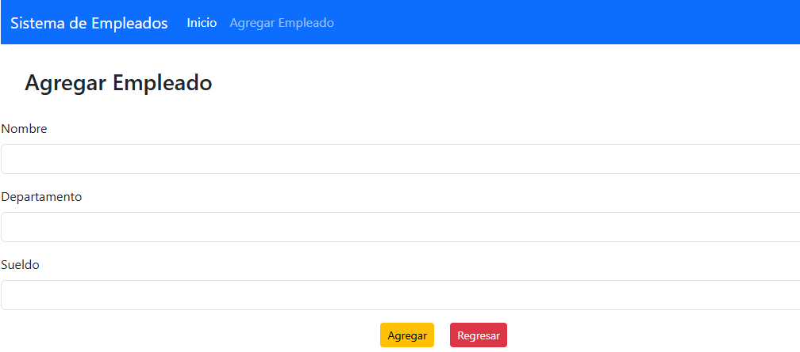
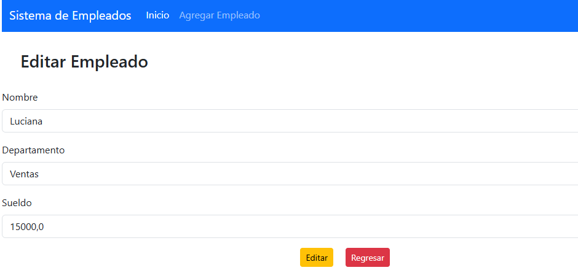

# 🏢 Sistema de Empleados con Spring Boot y MySQL

## 🖍️ Descripción  
Este proyecto consiste en una **aplicación web para la gestión de empleados**, desarrollada con **Spring Boot y MySQL**. La aplicación permite **agregar, modificar, eliminar y listar empleados**, proporcionando una interfaz sencilla y eficiente para la administración de los registros.  

Este sistema forma parte de un curso práctico de Java, explorando tecnologías modernas para la creación de aplicaciones empresariales escalables.  

## 🛠️ Tecnologías Usadas  
- **Lenguaje:** Java (versión 17 o superior).  
- **Framework:** Spring Boot.  
- **Persistencia de Datos:** JPA (Java Persistence API) con Hibernate.  
- **Base de Datos:** MySQL.  
- **Frontend:** Thymeleaf y Bootstrap.  
- **Herramientas:** IntelliJ IDEA / NetBeans / Eclipse (cualquier IDE compatible con Java).  

## 🔥 Características  
- Aplicación web para la gestión de empleados.  
- Operaciones CRUD (**Crear, Leer, Actualizar, Eliminar**) sobre los registros de empleados.  
- Uso de **Spring Boot y JPA** para la persistencia de datos.  
- Arquitectura basada en **MVC (Modelo-Vista-Controlador)** para una mejor organización del código.  
- Diseño responsivo con **Thymeleaf y Bootstrap**.  
- Integración con MySQL para almacenar la información de los empleados.  

## 🚀 Instrucciones de Instalación  
1. **Clona el repositorio** en tu máquina local:  
   ```bash
   git clone https://github.com/tu-usuario/sistema-empleados.git
   ```

2. **Modifica el archivo application.properties en src/main/resources con tus credenciales de MySQL:
   ````properties
   spring.datasource.url=jdbc:mysql://localhost:3306/empleados_db?createDatabaseIfNotExist=true
   spring.datasource.username=root
   spring.datasource.password=
   spring.datasource.driver-class-name=com.mysql.cj.jdbc.Driver

   spring.jpa.hibernate.ddl-auto=update
   spring.jpa.show-sql=true
   ````

3. **Compila y ejecuta la aplicación:
   ```bash
   mvn clean install
   mvn spring-boot:run
   ```

4. **Accede a la aplicación web en tu navegador:
   ```arduino
   http://localhost:8080
   ```

## 🖼️ Sistema de Empleados  





