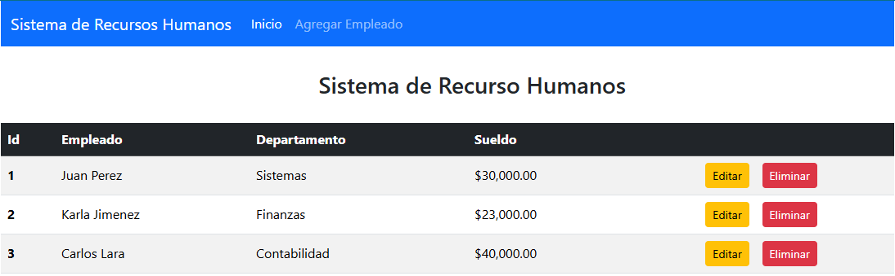
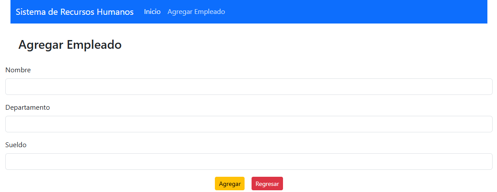
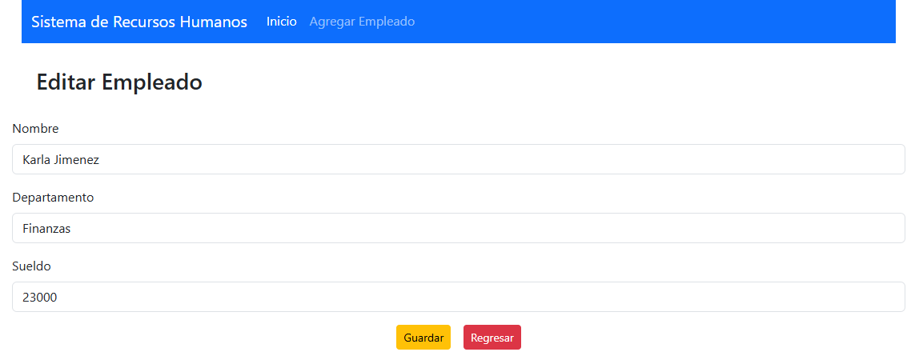

# 👥 Sistema de Recursos Humanos con React y Spring Boot  

## 📚 **Descripción**  
Este proyecto es una **aplicación fullstack** que permite gestionar un sistema de recursos humanos. Desarrollado como parte de un curso práctico de Java, utiliza **React** para el frontend y **Spring Boot** para el backend. La aplicación permite realizar operaciones como agregar, eliminar, actualizar y listar empleados, conectándose a una base de datos MySQL para almacenar la información de manera persistente.  

## 🛠️ **Tecnologías Usadas**  
- **Frontend:** React, JavaScript, HTML, CSS.  
- **Backend:** Spring Boot, Java (versión 17 o superior).  
- **Persistencia de Datos:** JPA (Java Persistence API).  
- **Base de Datos:** MySQL.  
- **Herramientas:** IntelliJ IDEA (backend), Visual Studio Code (frontend).  

## 🧩 **Características**  
- Permite gestionar empleados en un sistema de recursos humanos (crear, leer, actualizar y eliminar).  
- Usa React para crear una interfaz gráfica moderna y responsive.  
- Configuración simplificada gracias a Spring Boot.  
- Interfaz web intuitiva y fácil de usar.  

## 🚀 **Cómo Ejecutar el Proyecto**  

### **Requisitos Previos**  
- Java JDK 17 o superior (para el backend).  
- Node.js y npm instalados (para el frontend).  
- MySQL instalado y configurado.  
- Maven instalado (para gestionar dependencias del backend).  

### **Pasos para Configurar y Ejecutar**  

#### **Backend (Spring Boot)**  
1. **Clona el repositorio:**  
   ```bash
   git clone https://github.com/tu-usuario/java-13-proyectos-udemy.git
   ```

2. **Navega a la carpeta del proyecto:**
   ```bash
    cd java-13-proyectos-udemy/5-Fullstack-Apps/day-13-hr-system/backend
   ```

3. **Configura la base de datos:**
   - Asegúrate de que MySQL esté en ejecución.

   - El archivo `application.properties` ya está configurado para usar la base de datos `contactos_db`. Si no existe, se creará automáticamente gracias a la opción `createDatabaseIfNotExist=true`.

   - Verifica que las credenciales de MySQL coincidan con las de tu entorno. El archivo `application.properties` contiene:
     ````properties
     # Conexión MySQL
      spring.datasource.url = jdbc:mysql://localhost:3306/recursos_humanos_db?createDatabaseIfNotExist=true
      spring.datasource.username = root
      spring.datasource.password =
      spring.datasource.driver-class-name = com.mysql.cj.jdbc.Driver

      # Configuración de Hibernate
      spring.jpa.hibernate.ddl-auto = update
      spring.jpa.show-sql = true
     ````

   - Si tu usuario de MySQL no es `root` o si tienes una contraseña, actualiza las propiedades `spring.datasource.username` y `spring.datasource.password`.
     
4. **Compila y ejecuta el proyecto:**
   - Usa Maven para compilar y ejecutar la aplicación:
   ```bash
   mvn spring-boot:run
   ```

**FrontEnd(React)**

1. **Navega a la carpeta del frontend:**
   ```bash
     cd java-13-proyectos-udemy/5-Fullstack-Apps/day-13-hr-system/frontend
   ```

2. **Instala las dependencias:**
    ```bash
     npm install
   ```

3. **Ejecuta el frontend:**
    ```bash
    npm start
   ```

## 📸 **Sistema de Recursos Humanos**  



